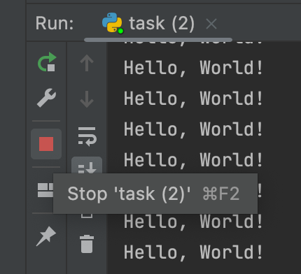

## Corrigir execução infinita

No editor de código, existe um loop `while` definido dentro de uma [função](course://Functions/Definition). Por favor, não se preocupe com isso no momento,
você aprenderá sobre funções na próxima seção. Da forma como está escrito no momento, o loop while dentro desta função
rodaria indefinidamente
porque a condição seria sempre `True`. Você pode ver por si mesmo executando o código. Para terminar a execução,
use o botão vermelho de parar no lado esquerdo da janela Run.

### Tarefa
Corrija o código para que
o loop termine após imprimir `"Hello, World!"` 5 vezes.

 

Atualize o valor de `i` a cada iteração.

